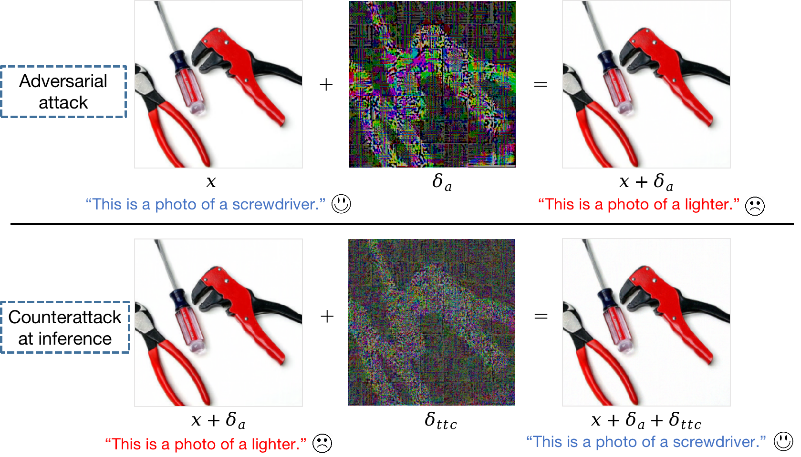
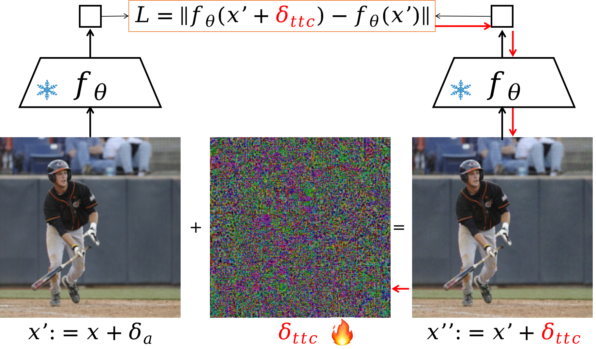

# CLIP-Test-time-Counterattacks 🚀
This is the official code of our work:

[CLIP is Strong Enough to Fight Back: Test-time Counterattacks towards Zero-shot Adversarial Robustness of CLIP](https://arxiv.org/abs/2503.03613). Songlong Xing, Zhengyu Zhao, Nicu Sebe. To appear in CVPR 2025.

> **Abstract**: Despite its prevalent use in image-text matching tasks in a zero-shot manner, CLIP has been shown to be highly vulnerable to adversarial perturbations added onto images. Recent studies propose to finetune the vision encoder of CLIP with adversarial samples generated on the fly, and show improved robustness against adversarial attacks on a spectrum of downstream datasets, a property termed as zero-shot robustness. In this paper, we show that malicious perturbations that seek to maximise the classification loss lead to `falsely stable' images, and propose to leverage the pre-trained vision encoder of CLIP to counterattack such adversarial images during inference to achieve robustness. Our paradigm is simple and training-free, providing the first method to defend CLIP from adversarial attacks at test time, which is orthogonal to existing methods aiming to boost zero-shot adversarial robustness of CLIP. We conduct experiments across 16 classification datasets, and demonstrate stable and consistent gains compared to test-time defence methods adapted from existing adversarial robustness studies that do not rely on external networks, without noticeably impairing performance on clean images. We also show that our paradigm can be employed on CLIP models that have been adversarially finetuned to further enhance their robustness at test time. Our code is available here.

<p align="center">
  
  &nbsp;&nbsp;&nbsp;&nbsp;&nbsp;&nbsp;
  
</p>

## 🛠️ Setup
### Environment
Make sure you have installed conda and use the following commands to get the env ready!
```bash
conda env create -f environment.yml
conda activate TTC
pip install -r requirements.txt
```
### Data preparation
Please download and unzip all the raw datasets into `./data`. It's okay to skip this step because torchvision.datasets will automatically download (most of) them if you don't already have them as you run the code.

## 🔥 Run
The file `code/test_time_counterattack.py` contains the main program. To reproduce the results of TTC employed on the original CLIP (Tab.1 in the paper), run the following command:
```bash
conda activate TTC
python code/test_time_counterattack.py --batch_size 256 --test_attack_type 'pgd' --test_eps 1  --test_numsteps 10 --test_stepsize 1 --outdir 'TTC_results' --seed 1 --ttc_eps 4 --beta 2 --tau_thres 0.2 --ttc_numsteps 2
```
The results will be saved in the user-specified folder of `--outdir`.

## 📬 Updates
 7 Mar 2025: **Please stay tuned for instructions to run the code!**
 
10 Mar 2025: **Setup updated!**

## 🗂️ Reference
```
@article{xing2025clip,
  title={CLIP is Strong Enough to Fight Back: Test-time Counterattacks towards Zero-shot Adversarial Robustness of CLIP},
  author={Xing, Songlong and Zhao, Zhengyu and Sebe, Nicu},
  journal={arXiv preprint arXiv:2503.03613},
  year={2025}
}
```

## Ackowledgement
Our code is developed based on [TeCoA (ICLR-23)](https://github.com/cvlab-columbia/ZSRobust4FoundationModel). We thank the authors for their work. Please also consider citing their paper:
```
@inproceedings{maounderstanding,
  title={Understanding Zero-shot Adversarial Robustness for Large-Scale Models},
  author={Mao, Chengzhi and Geng, Scott and Yang, Junfeng and Wang, Xin and Vondrick, Carl},
  booktitle={The Eleventh International Conference on Learning Representations},
  year={2023}
}
```
